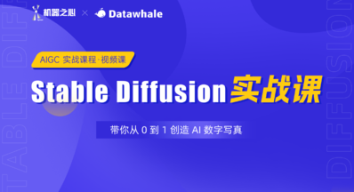
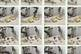

# 机器之心

> 原文链接: https://www.jiqizhixin.com

---
[

机器之心·PRO通讯会员

一份让您从此不再担心错失AI赛道良机的业内通讯

](https://pro.jiqizhixin.com/inbox)

会员通讯

Week 13 · 更高权限的 AI Agent 需要怎样的 AI Infra？本周，宇树科技科创板 IPO 申请获上交所正式受理；海外法律 AI 创企 Harvey 完成 2 亿美元新一轮融资。

订阅会员畅读

专题解读

388

[更高权限的 AI Agent 需要怎样的 AI Infra？](https://pro.jiqizhixin.com/reference/e2d2143f-d160-4756-88b1-966801a41a4b)

[Context 还不够，Harness 才是 Agent 工程优化的正解？](https://pro.jiqizhixin.com/reference/f60b4589-f46f-4eb2-b101-7b5d94811c22)

[从「模型」到「部署」，如何理解 AI 技术进步背后的基础设施挑战？](https://pro.jiqizhixin.com/reference/8dfd3343-75d5-4571-9112-0dcd444ffdab)

文章库

已追踪 AI 发展 4107 天，29148 篇原创内容

量子模拟首次获实验验证，量子计算机或将用作虚拟实验室

今天

AI for Science

量子

ClawTip来了！ 京东科技首发推出AI智能体的“专属自主零钱包”

今天

ClawTip

京东科技

龙虾太难养？刚刚发布的SOLO独立端，可能是你要的AI生产力

今天

SOLO 独立端

Trae

ICLR 2026 | 复旦&通义万相提出ProMoE，显式路由引导打破DiT MoE scaling瓶颈！

今天

ProMoE

ICLR 2026

支付宝推出国内首个支付集成Skill，Vibe Coding时可自然语言接入支付

今天

支付集成Skill

支付宝

京东卷出新高度！硬刚「复杂指令」长时长、自由态数字人直播终于丝滑了

今天

JoyStreamer

JoyAvatar

数字人

京东

不加算力，只改一个算法：Muon在万亿MoE模型中最高2倍加速

今天

Gram Newton-Schulz

普林斯顿大学

ICLR 2026 | 大模型当裁判也「翻车」？北大清华联合多校提出TrustJudge，让LLM评估更值得信赖

今天

TrustJudge

ICLR 2026

"看图说话"到"看人读心": 具身智能最缺的一块拼图，被这个多模态数据集补上了

今天

CUHK-X

香港中文大学

300万对样本、200万对实拍：深度估计的数据荒，终于被打破

今天

LingBot-Depth-Dataset

蚂蚁灵波

直指具身智能核心瓶颈，千寻智能高阳团队提出 Point-VLA：首次以视觉定位实现语言指令精准执行

今天

Point-VLA

千寻智能

爱诗科技PixVerse V6 正式发布，AI视频生成迈向“真实世界模拟”

今天

视频生成模型

PixVerse V6

爱诗科技

进入文章库，查阅过往文章