# 量子位

> 原文链接: https://www.qbitai.com

---
[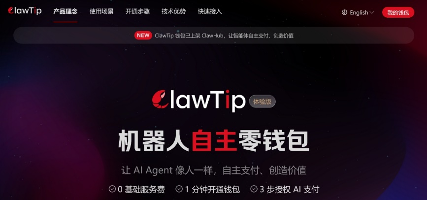](https://www.qbitai.com/2026/03/394011.html)

#### [ClawTip来了！ 京东科技首发推出AI智能体的“专属自主零钱包”](https://www.qbitai.com/2026/03/394011.html)

AI智能体之间真正自主支付的钱包，来了！

[量子位](/?author=19) 3小时前

[京东](https://www.qbitai.com/tag/%e4%ba%ac%e4%b8%9c)

[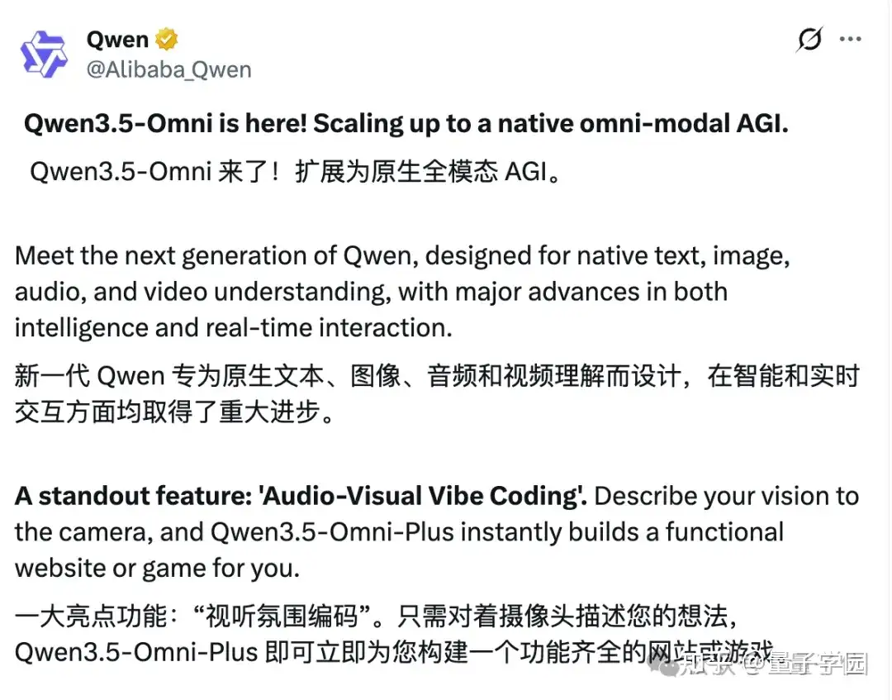](https://www.qbitai.com/2026/03/393941.html)

#### [实测拿215项SOTA的Qwen3.5-Omni：摄像头一开，AI给我现场讲论文、撸代码](https://www.qbitai.com/2026/03/393941.html)

能看能听能唠嗑，还能现场vibe coding

[听雨](/?author=47859) 3小时前

[AI](https://www.qbitai.com/tag/ai) [Qwen](https://www.qbitai.com/tag/qwen) [人工智能](https://www.qbitai.com/tag/%e4%ba%ba%e5%b7%a5%e6%99%ba%e8%83%bd) [千问](https://www.qbitai.com/tag/%e5%8d%83%e9%97%ae) [阿里](https://www.qbitai.com/tag/%e9%98%bf%e9%87%8c)

#### [瑞声科技公开人形机器人感知解决方案，释放机器人业务加速落地信号](https://www.qbitai.com/2026/03/393883.html)

机器人产业链的竞争，正在从单点技术能力转向系统能力、工程能力和交付能力的综合比拼

[量子位](/?author=19) 6小时前

[人形机器人](https://www.qbitai.com/tag/%e4%ba%ba%e5%bd%a2%e6%9c%ba%e5%99%a8%e4%ba%ba) [瑞声科技](https://www.qbitai.com/tag/%e7%91%9e%e5%a3%b0%e7%a7%91%e6%8a%80)

[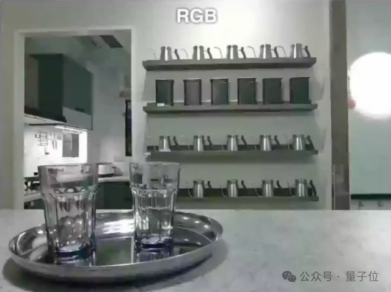](https://www.qbitai.com/2026/03/393864.html)

#### [2700GB高质量数据，训出空间智能SOTA，背后秘诀全栈开源](https://www.qbitai.com/2026/03/393864.html)

300万对RGB-D数据，专治机器人看不清

[一凡](/?author=47837) 6小时前

[具身智能](https://www.qbitai.com/tag/%e5%85%b7%e8%ba%ab%e6%99%ba%e8%83%bd) [蚂蚁灵波](https://www.qbitai.com/tag/%e8%9a%82%e8%9a%81%e7%81%b5%e6%b3%a2)

[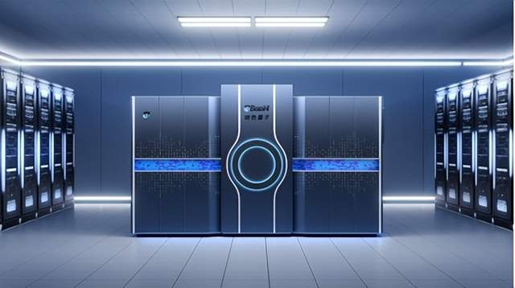](https://www.qbitai.com/2026/03/393856.html)

#### [玻色量子完成10亿元B轮融资，“十五五”规划专用量子计算机赛道唯一代表！](https://www.qbitai.com/2026/03/393856.html)

中国唯一“通用+专用”量子计算并行

[量子位](/?author=19) 7小时前

[玻色量子](https://www.qbitai.com/tag/%e7%8e%bb%e8%89%b2%e9%87%8f%e5%ad%90) [量子计算](https://www.qbitai.com/tag/%e9%87%8f%e5%ad%90%e8%ae%a1%e7%ae%97)

[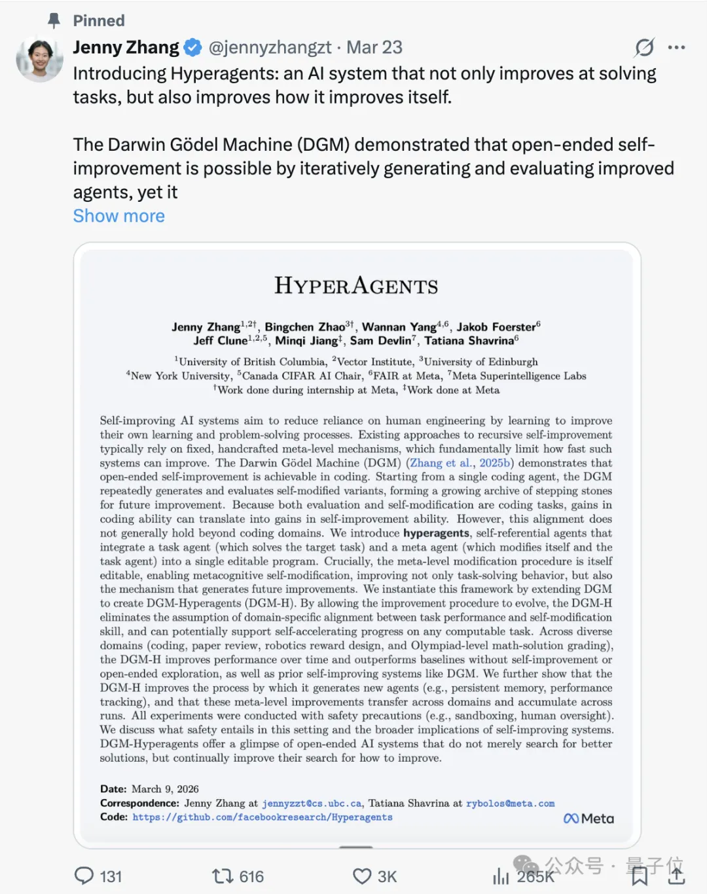](https://www.qbitai.com/2026/03/393645.html)

#### [Meta华人实习生搞出超级智能体！自己写代码实现自我进化](https://www.qbitai.com/2026/03/393645.html)

Agent实现改进方法的自我迭代

[henry](/?author=47850) 7小时前

[Agent](https://www.qbitai.com/tag/agent) [元学习](https://www.qbitai.com/tag/%e5%85%83%e5%ad%a6%e4%b9%a0)

[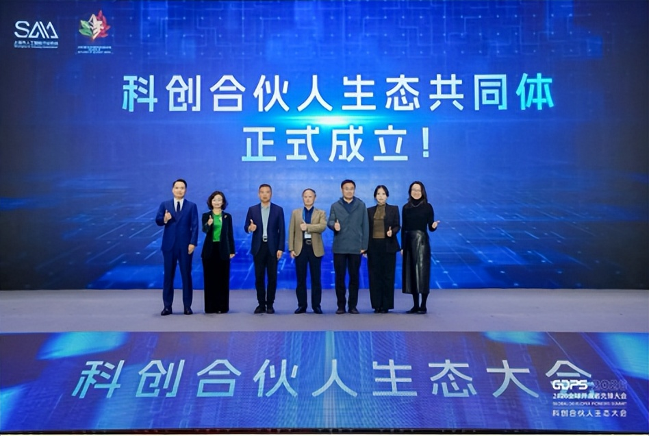](https://www.qbitai.com/2026/03/393631.html)

#### [2026科创合伙人大会成功举办！构建科创合伙人生态，激活高质量发展新动能](https://www.qbitai.com/2026/03/393631.html)

促进产研融合落地

[量子位](/?author=19) 7小时前

[全球开发者先锋大会](https://www.qbitai.com/tag/%e5%85%a8%e7%90%83%e5%bc%80%e5%8f%91%e8%80%85%e5%85%88%e9%94%8b%e5%a4%a7%e4%bc%9a)

[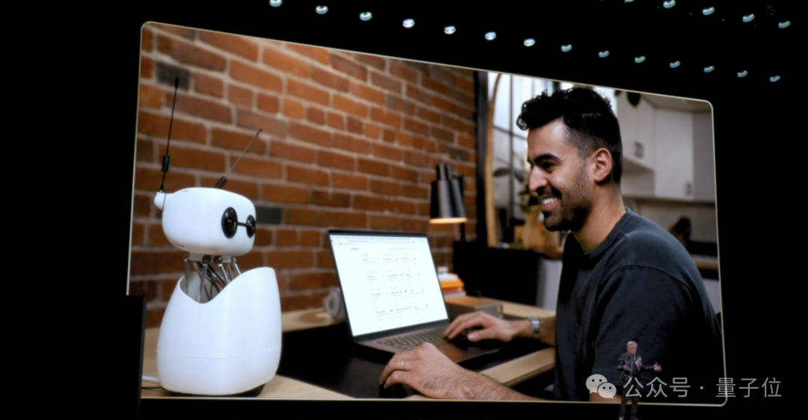](https://www.qbitai.com/2026/03/393483.html)

#### [黄仁勋也站台的抱抱脸机器人卖爆了，背后公司竟来自中国](https://www.qbitai.com/2026/03/393483.html)

数据驱动的具身智能范式正在重新定义硬件

[henry](/?author=47850) 7小时前

[Hugging Face](https://www.qbitai.com/tag/hugging-face) [机器人](https://www.qbitai.com/tag/%e6%9c%ba%e5%99%a8%e4%ba%ba)

#### [别再让AI只干零活了！AI工具正在接管投放全链路](https://www.qbitai.com/2026/03/393471.html)

从行业中来，到行业中去

[克雷西](/?author=47832) 11小时前

[AI营销](https://www.qbitai.com/tag/ai%e8%90%a5%e9%94%80) [快手](https://www.qbitai.com/tag/%e5%bf%ab%e6%89%8b)

[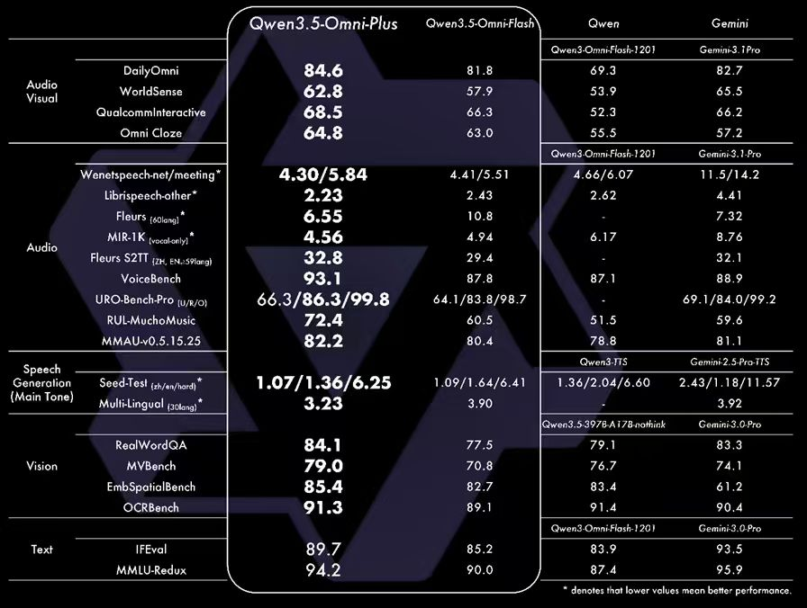](https://www.qbitai.com/2026/03/393460.html)

#### [阿里发布Qwen3.5-Omni，多模态能力超越Gemini-3.1 Pro](https://www.qbitai.com/2026/03/393460.html)

每百万Tokens输入不到0.8元，比Gemini-3.1 Pro的1/10还低。

[量子位](/?author=19) 21小时前

[阿里云](https://www.qbitai.com/tag/%e9%98%bf%e9%87%8c%e4%ba%91)

#### [“杭州六小龙”第一股来了！浙大校友创业，年入8亿冲刺IPO](https://www.qbitai.com/2026/03/393419.html)

群核科技已通过港交所上市聆讯

[听雨](/?author=47859) 昨天 16:56

[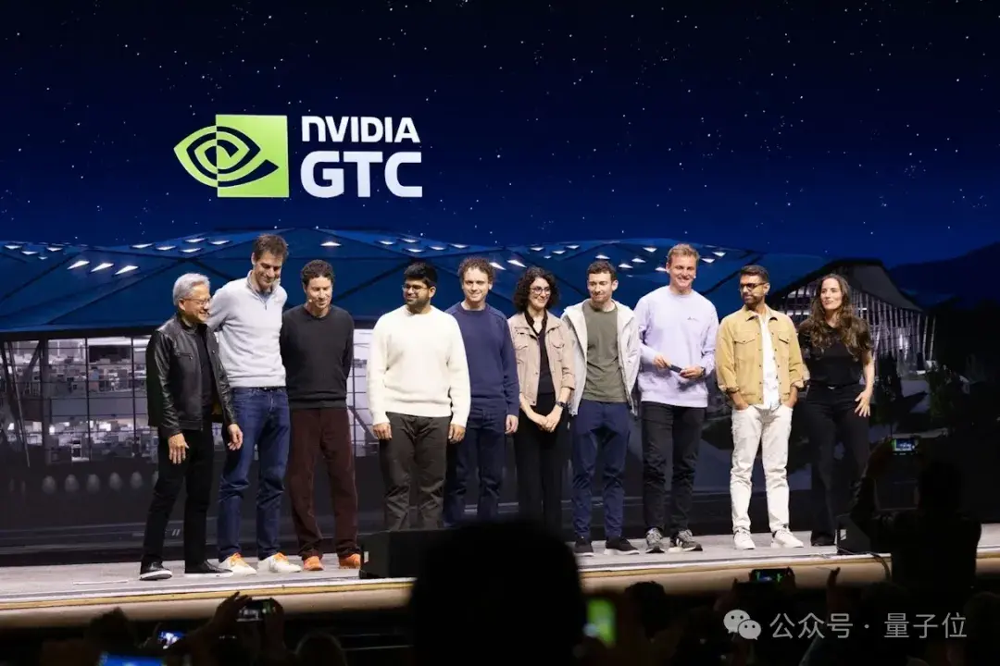](https://www.qbitai.com/2026/03/393395.html)

#### [美国开源AI最后的旗帜，也倒了](https://www.qbitai.com/2026/03/393395.html)

Ai2削减开源模型资金，研发人员集体出走

[听雨](/?author=47859) 昨天 16:47

#### [整个公司一起吃虾！这个开源项目，让OpenClaw实现企业级部署](https://www.qbitai.com/2026/03/393382.html)

一个系统，管好一池龙虾

[克雷西](/?author=47832) 昨天 16:45

[OpenClaw](https://www.qbitai.com/tag/openclaw)

[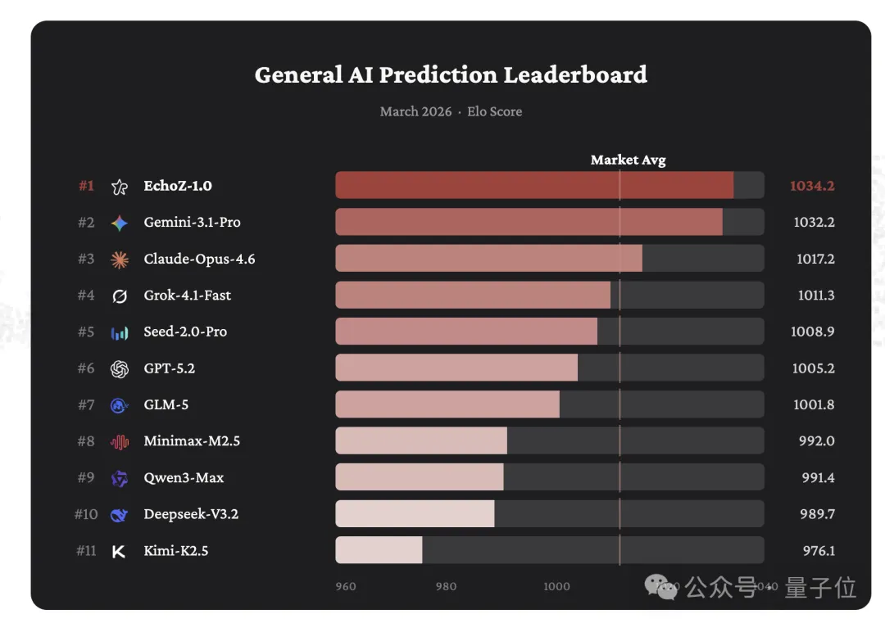](https://www.qbitai.com/2026/03/393353.html)

#### [预测这件事，人类越犹豫，这个大模型越有优势](https://www.qbitai.com/2026/03/393353.html)

Elo 1034.2分霸榜，领先Gemini-3.1-Pro、Claude-Opus-4.6

[西风](/?author=47833) 昨天 16:34

[AI预测](https://www.qbitai.com/tag/ai%e9%a2%84%e6%b5%8b)

[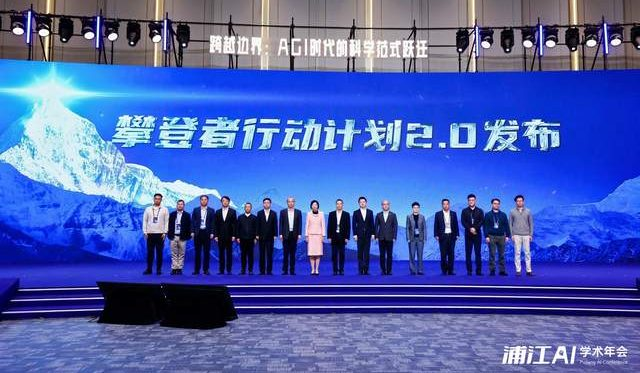](https://www.qbitai.com/2026/03/393344.html)

#### [上海AI实验室发布“AGI4S珠穆朗玛计划”，构建中国科学智能创新中枢](https://www.qbitai.com/2026/03/393344.html)

邀全球科研力量共同定义未来

[十三](/?author=21) 昨天 15:24

[AGI4S珠穆朗玛计划](https://www.qbitai.com/tag/agi4s%e7%8f%a0%e7%a9%86%e6%9c%97%e7%8e%9b%e8%ae%a1%e5%88%92) [上海AI实验室](https://www.qbitai.com/tag/%e4%b8%8a%e6%b5%b7ai%e5%ae%9e%e9%aa%8c%e5%ae%a4)

[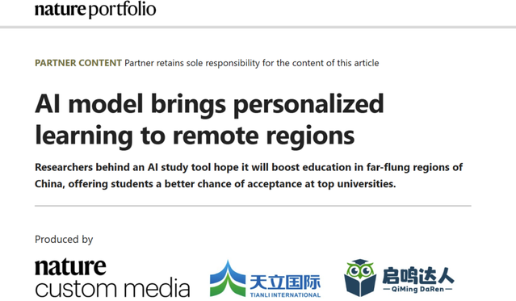](https://www.qbitai.com/2026/03/393336.html)

#### [Nature Index特刊聚焦天立国际：系统呈现中国教育AGI实践探索](https://www.qbitai.com/2026/03/393336.html)

以认知建模为核心的教育AGI探索

[量子位](/?author=19) 昨天 12:08

[AI教育](https://www.qbitai.com/tag/ai%e6%95%99%e8%82%b2) [Nature](https://www.qbitai.com/tag/nature) [天立国际](https://www.qbitai.com/tag/%e5%a4%a9%e7%ab%8b%e5%9b%bd%e9%99%85)

[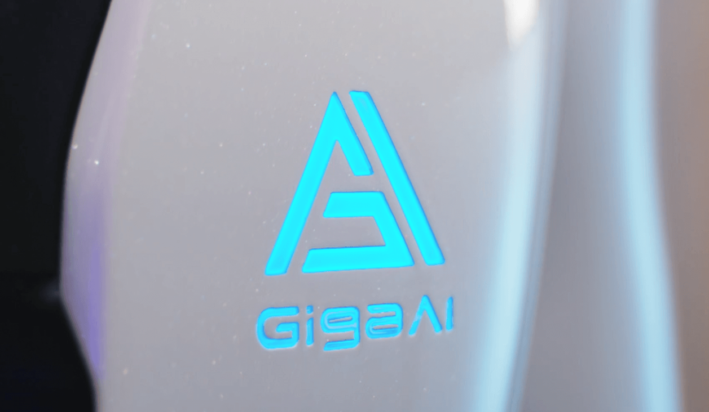](https://www.qbitai.com/2026/03/393296.html)

#### [国产世界模型登顶全球第一！断层领先谷歌英伟达，3D准确度近满分](https://www.qbitai.com/2026/03/393296.html)

最新Pre-B轮收获10亿融资

[量子位](/?author=19) 昨天 11:55

[世界模型](https://www.qbitai.com/tag/%e4%b8%96%e7%95%8c%e6%a8%a1%e5%9e%8b) [具身智能](https://www.qbitai.com/tag/%e5%85%b7%e8%ba%ab%e6%99%ba%e8%83%bd) [清华](https://www.qbitai.com/tag/%e6%b8%85%e5%8d%8e)

[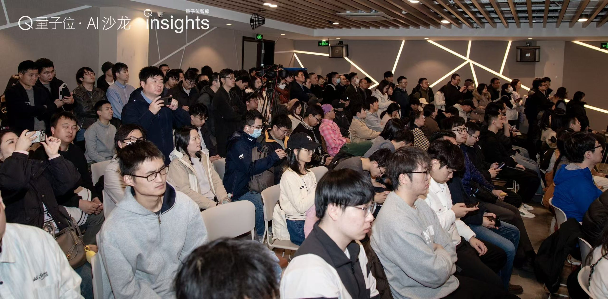](https://www.qbitai.com/2026/03/393244.html)

#### [60%用户还在乱养虾！9位大神亮招：有人多赚一笔钱，有人多睡1小时｜量子位沙龙](https://www.qbitai.com/2026/03/393244.html)

最野生最新鲜的实战方案奉上

[邓思邈](/?author=50) 昨天 11:49

[OpenClaw](https://www.qbitai.com/tag/openclaw) [养虾](https://www.qbitai.com/tag/%e5%85%bb%e8%99%be) [龙虾](https://www.qbitai.com/tag/%e9%be%99%e8%99%be)

[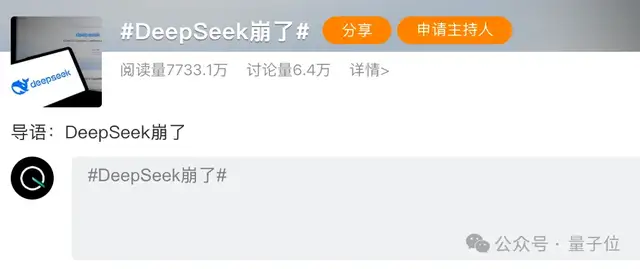](https://www.qbitai.com/2026/03/393235.html)

#### [DeepSeek网页版大升级！随后宕机11小时崩上热搜，新模型真的来了](https://www.qbitai.com/2026/03/393235.html)

在龙虾时代沉默了好久的DeepSeek，似乎在憋个大的

[梦晨](/?author=32) 昨天 11:33

[Deepseek](https://www.qbitai.com/tag/deepseek)

#### [单张显卡跑出15倍推理速度，aiX-apply-4B小模型加速企业AI研发落地](https://www.qbitai.com/2026/03/392787.html)

准确率93.8%超越DeepSeek-V3.2

[邓思邈](/?author=50) 昨天 08:41

[代码变更应用](https://www.qbitai.com/tag/%e4%bb%a3%e7%a0%81%e5%8f%98%e6%9b%b4%e5%ba%94%e7%94%a8) [北大](https://www.qbitai.com/tag/%e5%8c%97%e5%a4%a7) [硅心科技](https://www.qbitai.com/tag/%e7%a1%85%e5%bf%83%e7%a7%91%e6%8a%80)

[加载更多](javascript:void\(0\);)