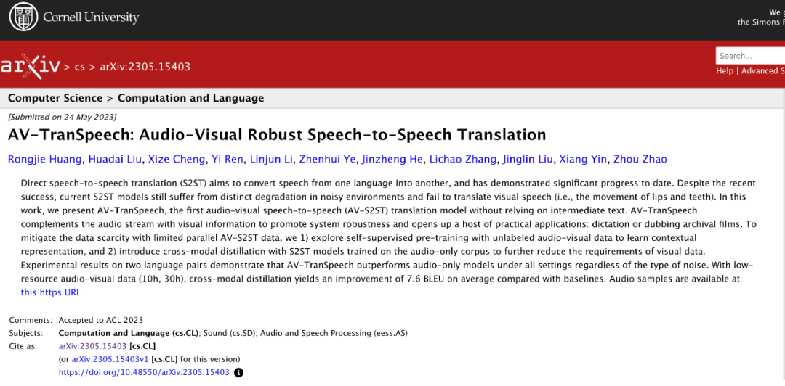
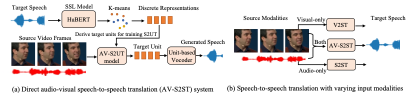
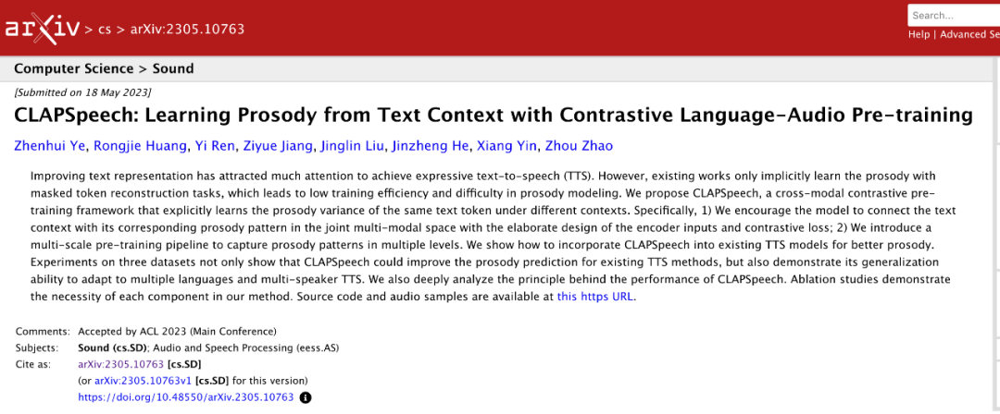
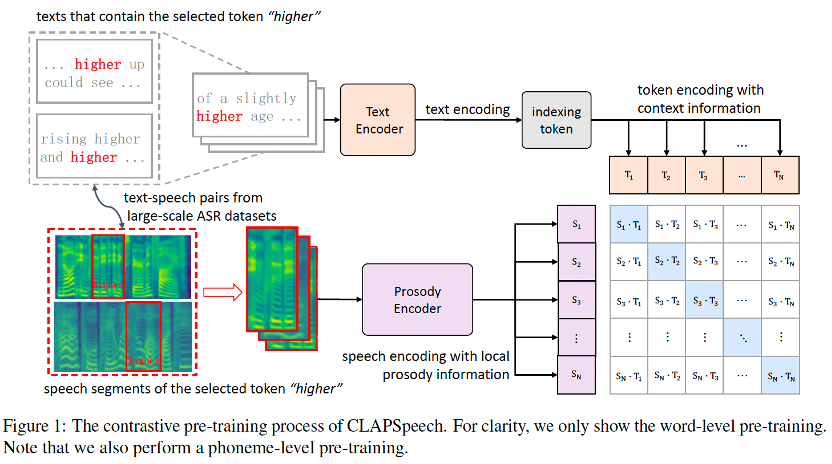
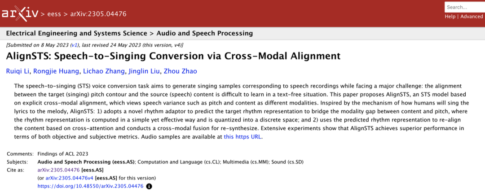
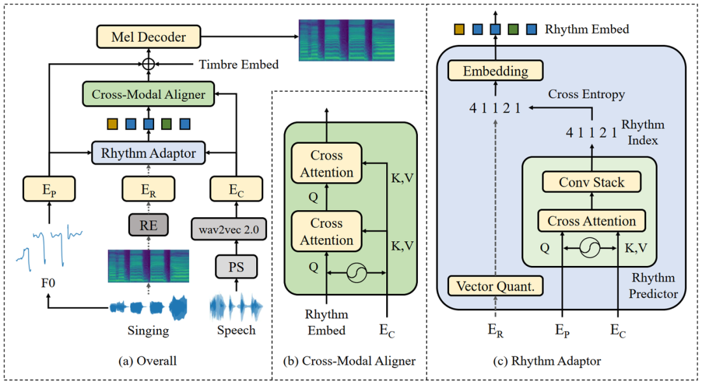
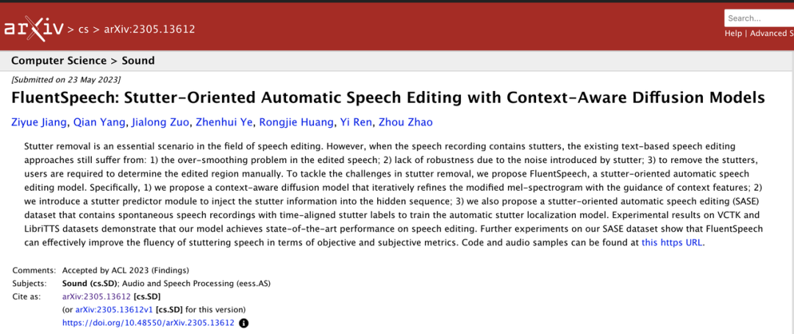
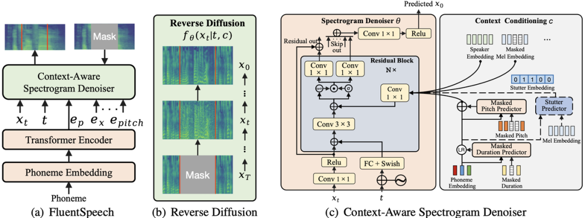

# ACL 2023发榜！火山语音推出业内首个借助视频信息的端到端语音翻译模型

> 公众号: PaperWeekly
> 发布时间: 2023年5月31日 13:20
> 原文链接: https://mp.weixin.qq.com/s/2KD8CYToz-mLZStwCXcSnA

---

**日前 ACL 2023 的论文录用结果公布，火山语音团队多篇论文成功入选，内容涵盖音频合成、歌声合成以及语音翻译等多个前沿技术领域的创新突破。**ACL（Annual Meeting of the Association for Computational Linguistics）每年由国际计算语言学协会举办，是自然语言处理与计算语言学领域最高级别的学术会议，也是中国计算机学会（CCF）A 类推荐会议，在世界范围内享有极高声誉，并受到全球各地语言领域人士的广泛关注。

▲ 图片来源：https://2023.aclweb.org/

**01**

/ AV-TranSpeech /

**论文题目：**

结合视觉信息的端到端语音翻译

AV-TranSpeech: Audio-Visual Robust Speech-to-Speech Translation

****

**研究背景：**众所周知，语音到语音翻译（S2ST）对于打破语言壁垒与沟通障碍非常有益。近年来业内利用自监督模型获得的离散单元，构建无文本且端到端的 S2ST 系统逐渐成为主流，但当前的 S2ST 模型在带噪的环境中仍然存在明显退化，并且无法翻译视觉语音（即唇动）。在这项工作提升中，火山语音团队联合浙江大学提出了 AV-TranSpeech，业内首个借助视频信息的无文本语音到语音翻译（AV-S2ST）模型，通过视觉信息补充音频流，以提高系统的稳健性，并开辟了一系列应用前景，例如口述、为档案电影配音等。

**方法介绍：**为了缓解 AV-S2ST 数据稀缺，团队率先探索使用无标记音视频数据进行自监督预训练，以学习上下文表示；此外使用在纯音频语料库上训练的 S2ST 模型引入跨模态蒸馏，进一步降低对视觉数据的要求。在两种语言对的实验结果表明，无论噪声类型如何，AV-TranSpeech 在所有设置下都优于纯音频模型，尤其是在低资源数据（10 小时、30 小时）下，跨模态蒸馏可提高 7.6 个 BLEU 点。“如图所示，我们使用自监督 HuBERT 来获得目标语音的离散单元；建立视听语音到单元转换（AV-S2UT）和应用单独训练的基于单元的声码器以将转换的单元转换成波形。”火山语音团队表示。

为了缓解音频和视频表示之间的长度不匹配，团队还添加了一个随机初始化的模态适配器层，该层由音频和视频流之间的步长为 2 的单个一维卷积层组成。“为了防止模型在联合模型中过度依赖音频流，我们在融合音频和视觉输入之前，包括一个概率为 p=50% 的模态 Dropout，迫使视觉编码器学习上下文表示。”

▲ 图1. AV-TranSpeech模型架构图

**呈现效果：**总结翻译准确性和语音自然度，火山语音发现：大规模多模式预训练在很大程度上提高了性能，这主要是因为 LRS3-T 是一个具有挑战性的数据集，有很大一部分视频是从 TED 演讲中收集的，显示了在不依赖中间文本或辅助多任务训练下 S2ST 的难度。此外，视觉模态的引入能够带来平均 2.0 个 BLEU 点的增益，即用视觉信息补充音频流，开辟了一系列实际应用，比方说实现无声听写或为档案无声电影配音。对于语音质量，由于团队应用了公开可用的预训练单元声码器，该声码器主要控制输出语音的自然度并保持不变，AV-TranSpeech 表现出高质量的语音生成。

**具体内容可参见：**

https://arxiv.org/abs/2305.15403

**02**

/ CLAPSpeech /

**论文题目：**

利用文本-语音对比学习提出针对语音合成的韵律文本表征

CLAPSpeech: Learning Prosody from Text Context with Contrastive Language-Audio Pre-Training

**研究背景：**提高文本表征是实现富有韵律的语音合成系统的重要途径，然而现有的工作通常采用基于语言模型 (BERT) 的文本表征来提升合成语音的韵律的方法，这就带来了使用预测掩码标记（masked token prediction）任务进行预训练，更关注的却是文本的语义信息而非语音的韵律，从而导致训练效率低以及韵律建模困难等问题。

**方法介绍：**基于上述观察，火山语音团队联合浙江大学提出了 CLAPSpeech，这是一个跨文本-语音模态的对比预训练方法。与现有工作不同，它从相同文本标记在不同语境下的韵律变化中学习，因而能够显式高效地从文本中提取韵律相关的信息。具体而言，首先我们巧妙设计一个文本编码器和韵律编码器，鼓励模型在联合跨模态空间中将文本上下文与其对应的韵律模式连接起来；第二团队引入了多尺度预训练方案，以在音素、词汇等不同层次上捕获韵律模式；最后展示了如何将 CLAPSpeech 整合到现有的 TTS 模型中以获得更好的韵律。

▲ 图2. CLAPSpeech的文本-语音跨模态对比学习训练流程

**呈现效果：**在两个 1000 小时级别的中英文语音合成数据集完成的实验均表明，采用 CLAPSpeech 提供的文本表征可以显著提升现有 TTS 方法的韵律建模；实验同时还证明了 CLAPSpeech 的泛化能力，可以适应多语言和多说话人的复杂语音合成任务。现有的语音合成、歌声合成等系统都可以很方便地使用 CLAPSpeech 预训练模型的文本表征以提升合成音频的韵律自然程度。

**具体内容可参见：**

https://arxiv.org/abs/2305.10763

**03**

/ AlignSTS /

**论文题目：**

基于跨模态对齐的从语音到歌声转换

AlignSTS: Speech-to-Singing Conversion via Cross-Modal Alignment

****

**研究背景：**从语音到歌声转换（Speech-to-Singing，STS）任务的目标是将语音样本转换为内容（歌词）一致的歌声样本，同时保证说话人的音色不变。在转换的过程中，需要提供目标音高作为转换的参考，相关的研究与技术不仅有助于探索人类声音的合成规律，也对计算机辅助音乐制作等领域有帮助。通常 STS 任务与传统人声转换任务（Voice Conversion，VC）不同的一点是其需要转换两个独立特征：第一个是节奏，即时间模态，是音素在时域上的排列方式；第二个是音高，即频率模态。以往的 STS 方法侧重于音高的转换，忽略了音素位置在语音和歌声两者之间的差距，这会导致合成的音素含混不清、顺序混乱，同时由于歌曲制作中常见的一字多音等情况，字符序列在给定的音高序列中的位置分配情也是是一个复杂的概率分布。

▲ 图3. AlignSTS模型架构图

**方法介绍：**对此，本方法提出了跨模态对齐的解决方案。重要的一点，团队提出了一个更简洁高效的时间模态表示，即节奏特征。该特征被用于缩小语音内容和目标音高之间的模态差异，可被视为一种软化的时长标注。根据经验观察，人类总能在给定歌词序列和音高序列的前提下创作出听感合理的歌词节奏，说明连接这两者的节奏特征的概率分布可被良好定义。本方法先对输入语音信息进行破坏和解耦，接着使用交叉注意力机制建模目标节奏特征，并使用节奏特征对语音特征进行重排列和重对齐，最后再使用扩散模型作为声学特征解码器以提高音质。

**呈****现效果：**在多轮实验中，本方法在总质量 MOS 评分和韵律 MOS 评分中获得了平均 0.39 和 0.36 的提升；同时在零样本测试中，只在纯歌声数据集上训练的模型能够在未见语音数据上获得 0.11 的提升，展现了良好的泛化性能。

**具体内容可参见：**

https://arxiv.org/abs/2305.04476

**04**

/ FluentSpeech /

**论文题目：**

针对口吃语音提出的自动化语音编辑系统

FluentSpeech: A Stutter-Oriented Automatic Speech Editing System

**研究背景：**最近基于文本的语音编辑受到业界的广泛关注，其中口吃消除作为语音编辑的一个关键子任务，有着十分广泛的应用场景，如短视频、电影、播客、YouTube 视频，讲座等，能够为媒体制作人提供极大的便利。然而之前的语音编辑工作仍然存在诸多不足之处，例如：

-   音质较低。生成的 mel 声谱图通常是模糊的，并且缺乏高频细节，导致修改区域出现不自然的声音；

-   没有针对口吃语音进行设计。当需要编辑的语音充满口吃时，由于文本和口吃语音内容之间的差异，导致文本到语音的对齐过程受到影响，使得系统的鲁棒性降低；

-   口吃区域需要手动定位，这对媒体制作人来说既费时又费力。

对此该论文首创性地针对口吃语音提出了一个自动化语音编辑系统，也就是 FluentSpeech。这是首个针对口吃消除任务进行优化的语音编辑系统，可以自动检测口吃区域将其去除，并同时生成具有丰富细节的流畅语音。此外它也在其他语音编辑任务（如增、删、改等）达到了 SOTA 效果，能够完成多场景下的零样本语音编辑，极大节省了配音人员、媒体制作者的人力投入。

▲ 图4. FluentSpeech模型架构图

**方法介绍：**首先团队采用了一种上下文感知的扩散模型，该模型可以显式理解待编辑语音的上下文信息（如基频、持续时间、口吃信息等）并利用这些信息作为条件来指导扩散和反向过程，这有助于 FluentSpeech 生成高质量而过渡自然的结果。“为了提高对口吃语音的鲁棒性，我们在训练过程中引入了一种条件口吃预测器，该预测器定位口吃区域，并将口吃信息注入帧级隐序列，以减少文本和口吃语音之间的信息差异。”此外预测的口吃区域可以被用于自动口吃去除过程。另外还提出了一个新的数据集，称为“面向口吃的自动语音编辑数据集”，该数据集包含具有时间对齐的口吃标签的语音数据，可以用于相关语音编辑系统的训练。

**呈现效果：**该系统在 VCTK 数据集上与最新的基线系统进行了对比实验，在常规语音编辑任务中，音质主观评测 MOS 分数提升了 0.18，说话人相似度主观评测 MOS 分数提升了 0.15。在该论文新收集的口吃语音数据集的实验中，系统对口吃语音具有很高的鲁棒性，其口吃区域预测的帧级别准确度为 80.5%，能够显著提高口吃语音的流畅性。

**具体内容可参见：**

https://arxiv.org/abs/2305.13612

一直以来，火山语音团队面向字节跳动内部各业务线，提供优质的语音 AI 技术能力以及全栈语音产品解决方案，并通过火山引擎对外提供服务。自 2017 年成立以来，团队专注研发行业领先的 AI 智能语音技术，不断探索AI 与业务场景的高效结合，以实现更大的用户价值。

🔍

现在，在**「知乎」**也能找到我们了

进入知乎首页搜索**「PaperWeekly」**

点击**「关注」**订阅我们的专栏吧

·

·

·

