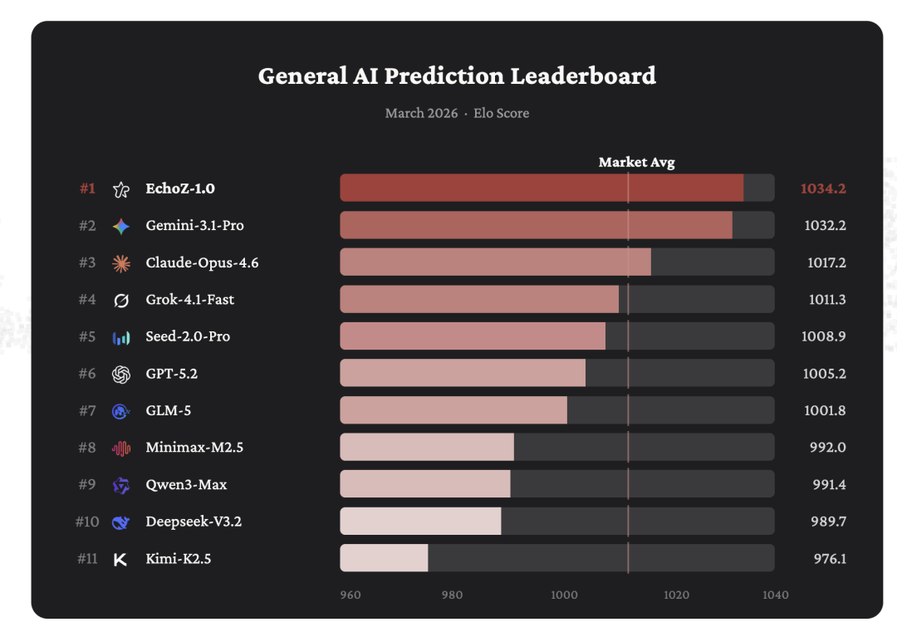
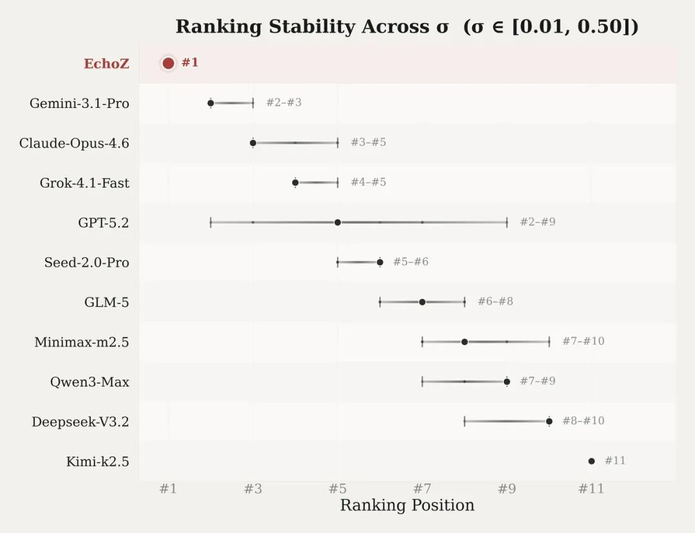
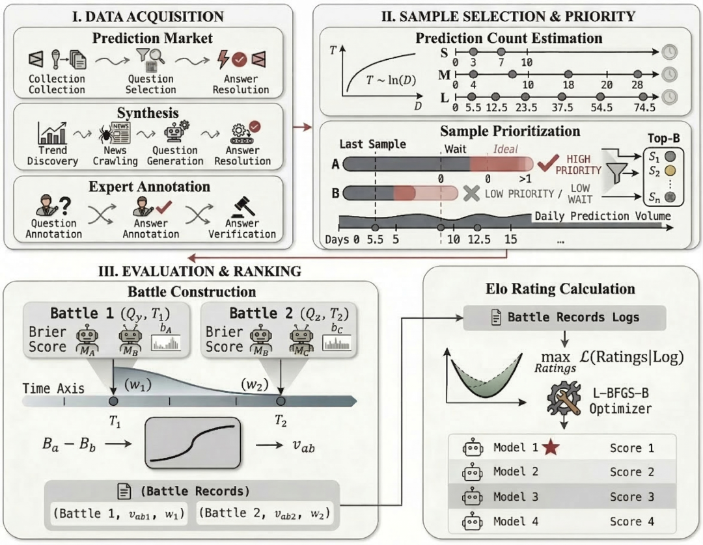
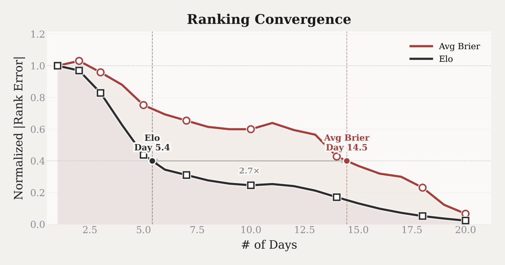
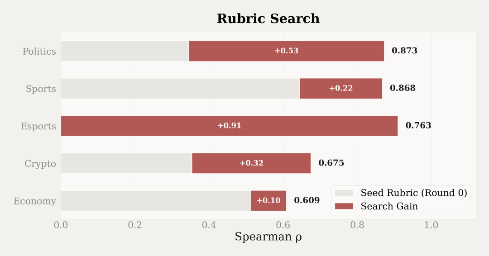

# Echo：预测智能的一小步，通往通用智能的一大步

> 公众号: 机器之心
> 发布时间: 2026年3月30日 09:34
> 原文链接: https://mp.weixin.qq.com/s/m0oPXIfYkRwSzhAarhlJMQ

---

机器之心发布

大模型能否预测未来？UniPat AI 构建了一套完整的预测智能基础设施，Echo，包含动态评测引擎、面向未来事件的训练范式和预测专用模型 EchoZ-1.0。在其公开的 General AI Prediction Leaderboard 上，EchoZ-1.0 稳居第一，并在与 Polymarket 人类交易市场的直接对比中展现出显著优势。

-   官网链接：https://echo.unipat.ai/

-   博客链接：https://unipat.ai/blog/Echo

一个悬而未决的验证问题

过去一年，预测能力越来越受到模型厂商的重视。但预测领域有一个根本性的验证难题：你说你能预测未来，怎么证明？发布时的 demo 无法追溯，事后公布的案例存在选择性偏差，通用基准测试衡量的是语言理解和推理能力，跟真实预测是两码事。

UniPat AI 近日发布的 Echo 系统，试图用一套完整的基础设施来回答这个问题。Echo 由三个紧密耦合的组件构成：

-   一个持续运转的动态评测引擎，

-   一套面向未来事件的后训练流程（Train-on-Future），

-   一个未来可能的 AI 原生预测 API。

核心模型 EchoZ\-1.0 是第一个在 Train-on-Future 范式下端到端训练的大语言模型。

在 General AI Prediction Leaderboard 上（2026 年 3 月数据），EchoZ-1.0 以 Elo 1034.2 排名第一，领先 Google 的 Gemini-3.1-Pro（1032.2）和 Anthropic 的 Claude-Opus-4.6（1017.2）。排行榜涵盖 12 个模型，覆盖政治、经济、体育、科技、加密货币等 7 个领域，活跃题目超过 1000 道。

EchoZ在排名鲁棒性测试中稳定第一

排名本身只是一个快照，排名的稳定性更值得关注。

博客中披露了一组 σ 参数敏感性测试：调整 Elo 框架中的 σ 参数（控制 Brier Score 差异向胜率的转化强度）从 0.01 到 0.50 共 9 个取值，重新计算全部模型排名。这个参数简单来说，就是控制“模型之间表现差距”会被放大到什么程度。

EchoZ 在全部 9 个分组均保持第一，是唯一排名未发生任何波动的模型。作为对比，GPT-5.2 的排名在第 2 到第 9 之间波动过 8 个位次。

更有说服力的一个细节是，EchoZ 的竞争对手不仅有顶级大模型，还有预测市场上真实投入资金的人类交易者的聚合判断，EchoZ 的 Elo 分数显著高于这条基线。与此同时，Echo 官网公开了所有预测问题、模型输出的概率分布和最终结算结果，任何人都可以回溯验证。

三个层面的可验证性叠加在一起（动态排行榜、实盘市场对照、全量数据公开），构成了 Echo 与此前各种 "AI 预测" 最根本的区别。

那么，EchoZ 对人类预测者的实际优势有多大？Unipat AI 给出了一组分层对比：将 EchoZ 与人类市场在同一预测批次中的同一问题上进行比较，基于 Brier Score 计算胜率，按领域、预测期限和市场不确定性三个维度展开：

-   政治与治理领域：EchoZ 胜率 63.2%

-   长期预测（7 天以上）：EchoZ 胜率 59.3%

-   市场不确定区间（人类信心 55%-70%）：EchoZ 胜率 57.9%

一个值得注意的规律是：人类预测者越犹豫的场景（高不确定性、长时间跨度、复杂政治博弈）EchoZ 的优势反而越明显。这暗示模型在信息整合和概率校准上的系统性优势，恰好在人类直觉最不可靠的区域得到了最大程度的释放。

一个持续生长的评测引擎

构建评测基准本身并不新鲜，但 Echo 的做法有一个关键差异：它构建的不是一个静态的题库，而是一个能够自动出题、自动结算、持续更新排名的动态系统。

为什么 "动态" 这件事很重要？

拿一道具体的预测题来说："2026 年 3 月 31 日收盘时，全球市值最大的公司是哪家？" 如果模型 A 在 3 月 1 日给出了预测，模型 B 在 3 月 28 日给出了预测，两者的正确率能直接比较吗？

显然不能。

越接近结算时间，可用信息越多，预测难度越低。这就是现有预测基准的第一个结构性问题：时序不对称。第二个问题是题源过于单一：现有基准的题目几乎全部来自预测市场，偏向容易结算的二元问题，大量来自专业领域和新兴话题的预测需求被遗漏了。

Echo Leaderboard 的架构正是围绕这两个问题展开的。整套系统可以拆解为四个阶段的持续循环：

Echo 评测引擎构建流程

第一步，数据采集。

三条数据管道同时运行。

第一条对接 Polymarket 等预测市场，筛选有明确结算规则和高质量共识信号的合约。

第二条面向开放域，抓取 Google Trends 等实时趋势，自动生成关于尚未发生事件的预测问题，由 agent 持续搜索进展并自动结算。

第三条来自真实专业场景：科研、工程、医疗等领域的专家将自己工作流中有价值的预测题贡献到系统中，并在预定时间点给出权威判定。

从 Polymarket 上的大众共识到实验室里的专家判断，三条管道覆盖了一个相当完整的预测光谱。

第二步，预测点调度。

 每道题不只做一次预测。系统使用对数调度算法，根据题目的结算周期长度分配多个 prediction points（预测时间点），既保证了生命周期内的覆盖密度，又控制了计算开销。

第三步，对战构建。

这是解决时序不对称问题的关键环节。评测使用 point-aligned Elo 机制：严格只比较 "同一道题、同一预测时间点" 的结果。所有参赛模型在完全相同的信息上下文下对决，公平性由此建立。

第四步，Elo 评分更新。

基于 Bradley-Terry MLE 算法计算全局排名。实验数据显示，这套框架对新加入模型的排名收敛速度是传统 Avg Brier 方法的 2.7 倍。

模型排名收敛速度对比

这四步构成一个不断循环的闭环：新题目持续流入，新的预测点持续触发，对战持续发生，排行榜持续更新。用一句话概括：

Echo 造了一把动态校准的尺子，而这把尺子本身也在不停生长。

Train-on-Future：当推理过程本身成为训练信号

评测引擎解决了 "怎么量" 的问题，接下来要回答的是 "怎么训"。Echo 的训练流程同样是一套结构化的系统，UniPat 称之为 Train-on-Future 范式，由三个核心机制组成。

在展开之前，有必要先理解传统路径（Train-on-Past）为什么走不通。用历史事件的已知结果来训练预测模型，面临两个很难绕过的困难。第一个是工程悖论：互联网内容持续更新，用过去的事件做训练题时，模型在搜索网页的过程中几乎必然会撞上包含答案的信息，数据泄露在工程实现上极难杜绝。第二个是结果导向偏差：现实事件充满随机性，一个逻辑严密的分析可能因为黑天鹅事件而给出 "错误" 答案，一个粗糙的猜测可能碰巧命中。直接用最终结果做训练信号，模型很容易过拟合到噪声上。

Train-on-Future 的三个机制分别瞄准了这些问题：

机制一：动态问题合成。 与使用历史题库不同，Echo 通过一条自动化管道，持续从实时数据流中生成关于未来事件的高信息量预测问题。因为每道题都关乎尚未发生的事件，训练天然不存在数据泄露的问题。

机制二：Automated Rubric Search。 这是整个训练范式中最有技术含量的部分。Echo 的做法是：把训练信号建立在推理过程的质量上，而非最终预测的对错。但随之而来的问题是，"好的推理过程" 该如何定义？

举一个体育预测领域的具体例子。Echo 的 Rubric 中有一个维度叫做 "Precursor and External Catalyst Evaluation"，评估模型是否利用高度相关的先行信号或外部驱动因素。得 5 分的标准是：识别具体的近期或即将发生的催化因素（如关键球员回归、连续客场结束、关键对位变化），并分析这些因素与比赛结果之间的历史关联。得 1 分的标准是：仅泛泛提及 “状态不错” 或 “士气提升” 等模糊因素，而未绑定具体可验证事件。

另一个维度是 "Multi-Factor Causal Synthesis"，评估模型是否将多个独立因素整合为一个有因果结构的预测结论。得 5 分的标准是：明确整合至少三个相互独立的因素（如伤病情况、近期状态、主客场表现、赔率基线），并解释这些因素如何相互作用（如伤病削弱进攻效率，而主场优势部分对冲该影响），最终形成一个加权后的整体判断。得 1 分的标准是：仅基于单一因素（如 “某队最近连胜”）直接得出结论，或简单罗列信息而没有解释各因素之间的作用关系。

总结来说，这两个维度分别关注模型是否能够在时间维度上引入可量化的前瞻性的关键变化，并在同一时点上将这些变化与既有信息整合为结构化的因果判断，从而提升预测的完整性与动态适应能力。

模型按rubrics打分的排名与Elo排名相关系数随rubrics质量提升而提升

这些维度高度具体，显然不是泛泛而谈的 "推理质量"。但靠人工设计也走不远，预测领域噪声极高，不同领域的逻辑差异很大。Echo 把这个问题转化成了一个数据驱动的搜索任务：由 LLM 生成候选评分标准（rubric），每一轮基于上一轮的反馈进行迭代，搜索目标是让 rubric 产生的模型排名与真实 Elo 排名之间的 Spearman ρ 最大化。搜索按领域独立进行，政治领域和体育领域各自搜索出 20 个评分维度。实验数据显示，rubric 的评估质量在迭代过程中持续攀升。

机制三：Map-Reduce Agent 架构。 训练完成后，EchoZ-1.0 在推理阶段采用分布式的 Map-Reduce 流程。Map 阶段将一个宏观预测问题分解为多个正交子任务，派出多个 agent 并行完成信息采集和领域推理；Reduce 阶段由聚合节点处理跨源冲突、对齐因果链，输出最终的概率判断。这个循环支持多轮自适应迭代，直到信息覆盖度和推理深度趋于稳定。

这套训练范式的本质可以这样理解：

不仅考察模型猜对了没有，也考察模型的分析过程是不是优秀。

而 "评价分析过程" 这件事本身，也由这个系统自动完成。

值得留意的下一步

据了解，UniPat 计划将 EchoZ-1.0 的预测能力封装为一套 AI-native Prediction API 对外开放。从博客已披露的技术架构来看，这套 API 将支持自然语言形式的预测问题输入，返回包含概率分布、分层证据链、反事实脆弱性评估和监测建议的完整结构化报告，每份报告由多轮 Map-Reduce agent 对实时网络证据循环检索和推理后生成。

UniPat 在官网上为 Echo 写下了这样一句话："The future is no longer a probability you guess — it is a parameter you integrate."

当预测从一种直觉判断变成一个可调用、可集成的参数，它能嵌入的决策场景，金融市场、算法交易、企业战略，远比当前看到的要多。UniPat 为 Echo 定义了四个关键词：General、Evaluable、Trainable，以及 Profitable。而落地的效果，则需要期待 API 的正式上线。

© THE END

转载请联系本公众号获得授权

投稿或寻求报道：liyazhou@jiqizhixin.com