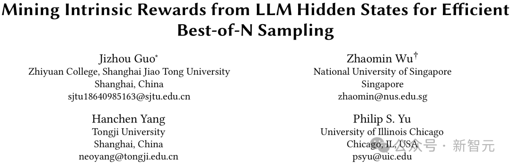
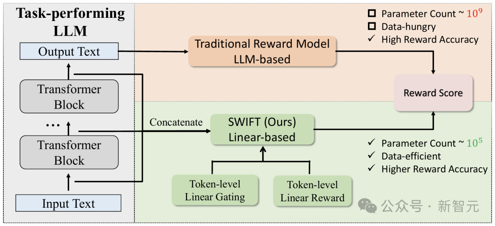
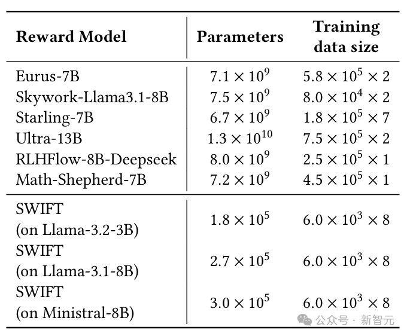
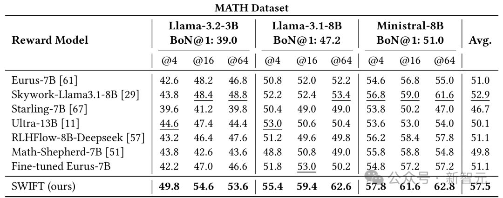
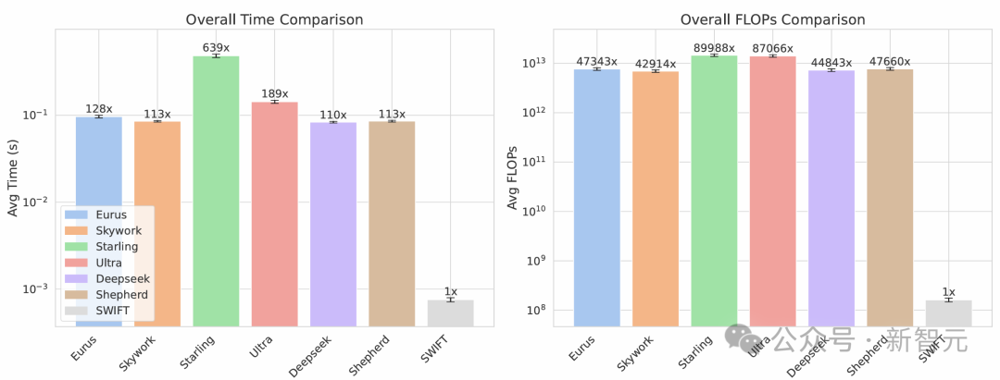
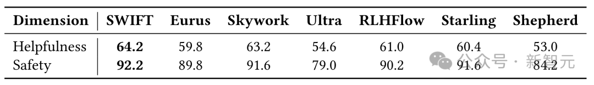

# 奖励模型变天！0.005%参数量推理速度翻倍，性能还更强

> 公众号: 新智元
> 发布时间: 2026年1月23日 13:13
> 原文链接: https://mp.weixin.qq.com/s/ka5bndnjGxux3qyOnz6Yeg

---
###

###

* * *

  **新智元报道**

编辑：LRST

##### **【新智元导读】最新奖励模型SWIFT直接利用模型生成过程中的隐藏状态，参数规模极小，仅占传统模型的不到0.005%。SWIFT在多个基准测试中表现优异，推理速度提升1.7×–6.7×，且在对齐评估中稳定可靠，展现出高效、通用的奖励建模新范式。**

在大语言模型的推理增强与对齐过程中，Best-of-N（优中选优）是一种常用的测试时增强策略：模型针对同一输入生成多条候选答案，再由奖励模型进行评分筛选。

然而，现有主流奖励模型往往本身规模庞大、推理开销高，并严重依赖大规模标注数据，逐渐成为在真实系统中部署的核心瓶颈。

为此，上海交通大学、新加坡国立大学、同济大学、伊利诺伊大学芝加哥分校的研究团队提出了**SWIFT（Simple Weighted Intrinsic Feedback Technique）**，一种全新的轻量级奖励模型。

论文链接：https://arxiv.org/abs/2505.12225

项目主页：https://aster2024.github.io/swift-website/

代码地址：https://github.com/aster2024/SWIFT

模型权重：https://huggingface.co/Aster2024/swift-ministral-8b-deepscaler

SWIFT 不再「读文本」，而是直接利用大语言模型生成过程中产生的隐藏状态，从中挖掘内在奖励信号，其参数规模仅为传统奖励模型的「**不到 0.005%」**，却在MATH、GSM8K、HellaSwag 等多个基准上取得更优的Best-of-N效果，并在端到端推理中带来**1.7×–6.7×**的整体加速。

同时，该方法在**有用性 / 安全性**等对齐评估任务中同样表现稳定，展示出作为通用奖励模型的潜力。

**奖励模型**

**推理增强的「隐形天花板」**

##

Best-of-N的基本思想并不复杂：对于同一个问题生成N条候选回答，再挑选其中最优的一条。

然而，在真实系统中，**真正昂贵的不仅是「多生成」，还有「如何评估」**。

当前主流做法通常采用文本级奖励模型，对每条候选答案进行完整编码和评分，这带来了多方面的挑战：

-   **模型体量大、推理开销高**：奖励模型往往拥有数十亿参数，几乎相当于再运行一次大模型；

-   **数据需求高**：训练高度依赖人工偏好数据或复杂的合成标注流程；

-   **系统扩展受限**：当 N 增大时，奖励模型的评估成本迅速吞噬 Best-of-N 带来的收益。

因此，一个关键问题逐渐凸显：**能否用一种更轻、更快、更易部署的方式，完成候选答案的高质量筛选？**

**隐藏状态中蕴含着模型「对自己答案的判断」**

##

SWIFT 的出发点来自一个重要观察：当大语言模型生成回答时，其内部各层的隐藏状态本身就携带了关于推理正确性、稳定性与置信度的丰富信息。

换句话说，模型在「思考」的过程中，已经在内部形成了对当前推理路径质量的判断信号。

与其额外训练一个庞大的文本模型去「读输出结果」，不如**直接从模型自身的隐藏状态中提取这些内在信号**，构建一个专门用于打分的轻量级奖励模型。

这一思路使得奖励建模不再依赖复杂的文本表示，而是转向对模型内部表示的高效利用。

**词元级线性打分+门控加权汇总**

##

SWIFT的整体结构非常简洁，但针对奖励建模的需求进行了精心设计，具体而言：

1.  对于生成序列中的每一个**词元**，收集大语言模型在该词元处的隐藏状态（来自所有层，或选定的部分层）；

2.  通过一个线性映射，同时预测「该词元的**奖励分数」和「**该词元的**重要性门控权重」**

3.  使用门控权重对词元奖励进行加权平均，得到整条生成路径的最终奖励分数。

其中，门控机制使模型能够自动关注对最终正确性更关键的词元（如关键推理步骤、数值计算、结论标记等），从而对整条推理轨迹进行更精细的评估。

整个奖励模型的参数规模仅与「层数 × 隐藏维度」成正比，相比传统文本奖励模型实现了数量级的压缩。

****

**如此轻量**

**参数规模与训练成本的数量级差距**

##

与动辄数十亿参数的传统奖励模型相比，SWIFT的参数规模仅为**10⁵量级**，在不同底座模型上的具体数值均远低于现有主流方案。

论文在参数量与训练数据规模的对比中显示：

SWIFT不仅模型规模极小，训练所需的数据量也显著更低，却依然能够取得具有竞争力甚至更优的性能表现。

这一特性使得SWIFT在资源受限环境或大规模部署场景中具备明显优势。

**在多个基准上全面超越主流奖励模型**

##

在数学推理与符号推理等核心基准上，研究团队系统评估了SWIFT在Best-of-N设置下的表现。

在MATH、GSM8K、AQuA-RAT、Imbue Code Comprehension、HellaSwag、CoinFlip数据集上，SWIFT在不同底座模型与不同N值配置下，整体准确率均优于多种主流开源奖励模型，且表现更加稳定。

更重要的是，这些性能提升并非以高昂计算代价为前提。论文进一步报告了端到端推理流程中的实际耗时：在相同的生成设置下，用SWIFT替换传统奖励模型，可带来1**.7×–6.7×**的整体加速。

****

**效率优势**

**时间与计算量均达到「数量级提升」**

##

在真实系统中，推理效率往往比离线指标更具决定性意义。论文通过对比每条样本的平均耗时与计算量，清晰展示了SWIFT在效率上的优势：平均推理时间显著降低；所需计算量（FLOPs）减少到原有方法的极小一部分；在不同数据集和底座模型组合下均保持一致趋势。

结果表明，SWIFT在效率层面实现了真正意义上的**数量级优势**，为大规模 Best-of-N推理提供了可行路径。

****

**从推理到对齐**

**在有用性/安全性评估中表现**稳定****

##

SWIFT并不局限于推理准确率的提升。研究团队进一步在对齐相关评估任务中验证了其通用性。

在PKU-SafeRLHF数据集上，采用Best-of-N设置，并使用强模型作为评判标准，对生成结果的**有用性与安全性**进行评估。结果显示，SWIFT在这两个维度上均优于多种大规模文本奖励模型。

这一结果表明，隐藏状态中蕴含的信息不仅能够反映推理正确性，也能刻画更广义的响应质量，为奖励模型在对齐评估中的应用提供了新的思路。

****

**工程化优势**

**更轻、更快、与传统奖励模型协同**

##

SWIFT 还展示了多种面向工程落地的扩展方式，使其不仅具备理论上的简洁性，也具备现实系统中的高度可用性：

-   **部分层训练**：消融实验进一步表明，相比模型前层，**靠近输出的后层隐藏状态包含更强的推理正确性信号**。仅使用少数后层训练 SWIFT，便可在显著减少参数规模与计算开销的同时，保持与使用全部层时接近的性能。这一结果说明，SWIFT 主要依赖模型在形成最终判断阶段的内部表示，而非早期的表层语言特征。

-   **仅基于输出分布（logits）的训练方式**：在无法访问隐藏状态的场景下，SWIFT 仍可仅依赖模型的输出分布进行训练。实验结果表明，即使在这种受限设定下，SWIFT 依然能够提取到具有判别力的质量信号。这一特性使其在一定程度上具备与部分闭源大模型兼容的可行性，显著拓宽了实际应用边界。

-   **与传统奖励模型组合**：得益于极小的参数规模（不足传统奖励模型的 0.005%），将 SWIFT 与现有奖励模型进行组合几乎不会引入额外的系统开销。论文探索了基于排序选择与加权融合的简单策略，实验表明，在多个基准上，这种组合方式能够进一步提升推理准确率。

综合来看，这些工程化特性使 SWIFT 不仅可以作为传统奖励模型的高效替代方案，也能够作为现有奖励模型体系中的轻量级补充模块，在几乎不增加部署成本的前提下提升整体系统性能。

**总结**

**奖励建模的新范式**

##

SWIFT 提供了一条不同于「更大模型、更重计算」的奖励建模路径：

-   直接利用大模型内部隐藏状态中的内在信号；

-   以极低的参数与数据成本，实现高效、稳定的奖励评估；

-   同时兼顾推理增强与对齐评估，具备良好的工程落地潜力。

这项工作表明，在大模型推理与对齐领域，**性能提升并不一定依赖于更复杂的外部模型，而可能来自对模型自身内部机制的更深入理解与利用**。

参考资料：

https://arxiv.org/abs/2505.12225

**秒追ASI**

**⭐点赞、转发、在看一键三连⭐**

**点亮星标，锁定新智元极速推送！**

