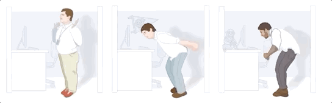
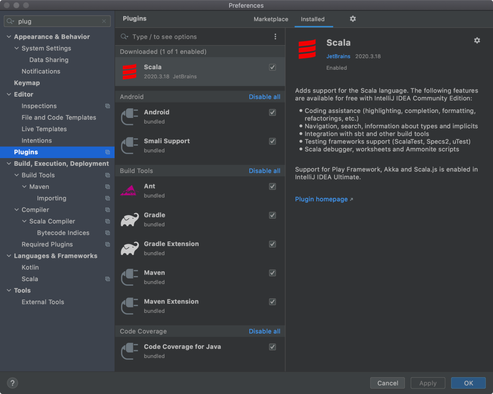
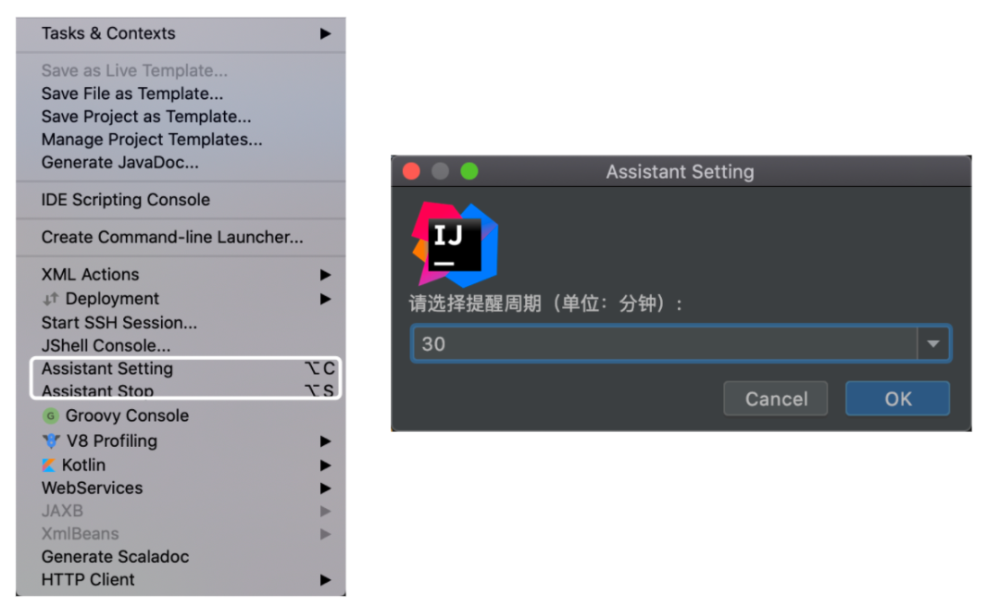
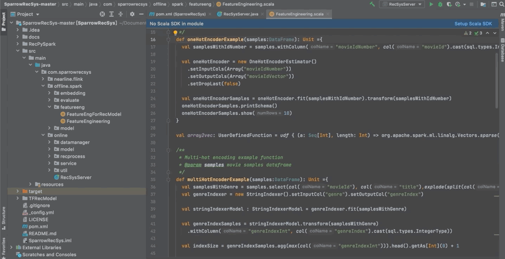
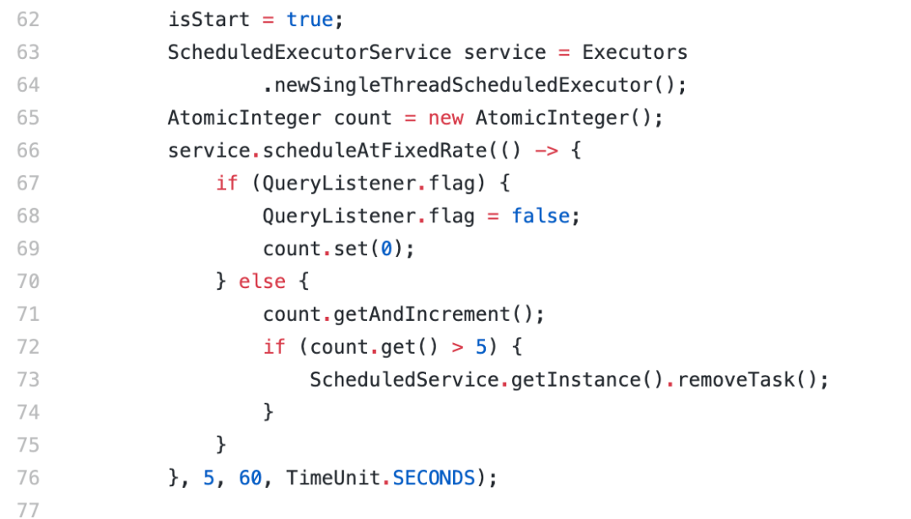

# 女朋友为我写了一个防猝死插件...

> 公众号: 51CTO技术栈
> 发布时间: 2021年2月8日 12:00
> 原文链接: https://mp.weixin.qq.com/s/G5bYt3crJ3dgGwgcoA8OBA

---
“

对于程序员来说，经常会遇到项目周期短的状况。白天开会讨论需求，晚上加班写代码，熬夜发版本，上线改 Bug。


_图片来自 Pexels_

工作日就是：开会、写代码、倒水、上厕所、抽烟、改 Bug，一天最开心的时刻就是带薪拉屎。


好不容易到了周末，有时还会通宵玩游戏，半个月也不运动一次。再好的身体，也会被这种高强度的工作，无规律的生活所击垮。

随着年龄越来越大，加上每天久坐不起来运动运动，这样下去身体真的顶不住。

久坐有挺多危害的：

-   **久坐可能会导致心脑血管疾病增加**

-   **久坐可能会导致免疫力低下**

-   **久坐可能会导致损脑伤胃**

-   **久坐可能会得痔\***


为了我身体健康，女朋友开发了一款插件，这插件可以 40 分钟提醒一次该起来起来运动啦，并且展示一些骚骚的动图。

12 个经典小动作让你肩不痛，腰不酸，腿不麻：



下面是插件的安装教程：

**①下载 Jar 包**

地址：

```
https://github.com/s-unscrupulous/idea_seat
```

**②安装插件**

打开 IDEA 设置→Plugins→右上角齿轮→Install Plugin from Disk：



**③开启插件**

工具栏 Tools 点击，找到 Assistant setting，就能设置提醒时间了。



过了半小时，弹出来一个胖胖的「打工人」动图，提醒你该休息了。



动图下方配上了一句话：原地踏步的时候，手掌向上朝天花板的方向推出去，手掌收回来的时候大拇指差不多要碰到你的肩膀，通过同时托举水瓶可以加大难度。

这插件不仅仅能提醒你该休息了，而且还提示你需要做哪些动作来缓解疲劳。


女朋友说这个插件装备了 12 种缓解疲劳的动作，让我自己去解锁......

我看了一下源码，女朋友在代码中加入了鼠标监听的功能，如果鼠标十分钟没有移动过，那就认为我在休息了。这时候会把定时任务取消，只有下一次移动鼠标时才会重新启动定时任务。



好了，大家对这个插件感兴趣的可以装一装，体验一下。这只是第一个版本，后面还会不断更新。

_作者：___老逛老逛__

________编辑：陶家龙________

_出处：__转载自公众号逛逛GitHub（ID：ggGithub）_


**精彩文章推荐：**

[上午写了一段代码，下午就被开除了...](http://mp.weixin.qq.com/s?__biz=MjM5ODI5Njc2MA==&mid=2655842604&idx=2&sn=51e43b8ff84f7698ed520884ea1362e4&chksm=bd74bcfb8a0335ed4d6b535e79d85cd07ab2a2e58f4a43b9d19aee48abc7335ca49bf6349f66&scene=21#wechat_redirect)

[线上又炸了，原来是索引的“锅”](http://mp.weixin.qq.com/s?__biz=MjM5ODI5Njc2MA==&mid=2655842482&idx=1&sn=3aa76c24399f4611ab239b9125328284&chksm=bd74bd658a033473fa43a12a4fb515d3e719b8223e2b6102f06ad44e94e0a40954caab5c5dd1&scene=21#wechat_redirect)

[我拍了拍Redis，被移出了群聊···](http://mp.weixin.qq.com/s?__biz=MjM5ODI5Njc2MA==&mid=2655842633&idx=1&sn=e197d830e410bed7296f5e40fc580caa&chksm=bd74bc9e8a033588c86cb3ab522d69bfe2cabd05a3cc9350f9377c681e4e3a806145b2816c18&scene=21#wechat_redirect)